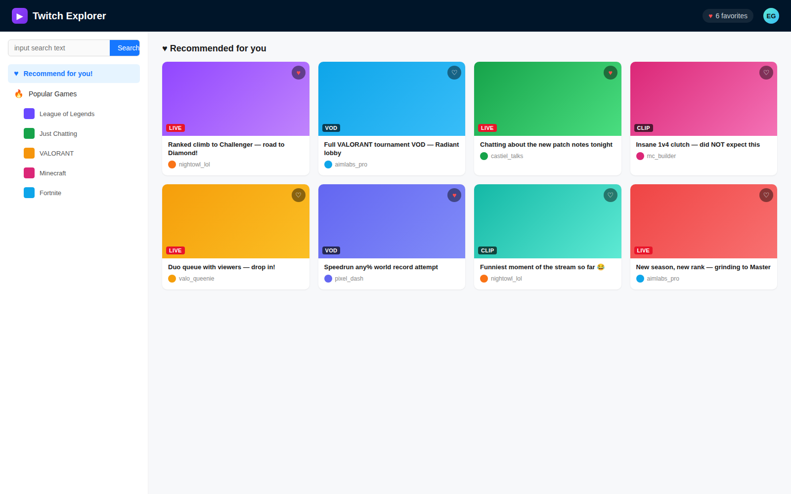

# Twitch Explorer

A full-stack content discovery app for Twitch — browse trending games, search streams/videos/clips, save favorites, and get personalized recommendations based on viewing history.

Built to practice designing a real REST API against a third-party OAuth-protected API (Twitch Helix), session-based auth, a relational data model, and a lightweight recommendation service — end to end, frontend to database.



## Highlights

- Designed a **content-based recommendation engine** that seeds candidate games from a user's favorite history, falls back to trending games for new/anonymous users, and excludes already-favorited items from the results.
- Used **Caffeine caching** on the recommendation endpoint with targeted cache eviction on every favorite/unfavorite, so recommendations stay fresh without recomputing on every request.
- Integrated Twitch's **Helix API** through **Spring Cloud OpenFeign** with an OAuth2 client-credentials flow, keeping third-party API auth decoupled from user auth (which runs on Spring Security sessions).
- Modeled a relational schema (`users`, `items`, `favorite_records`, `authorities`) with foreign-key constraints and a unique composite key to enforce "no duplicate favorites" at the database level, not just in application code.

## Features

- Browse top games and drill into streams / videos / clips for any game
- Full-text game search
- User accounts: register / login / logout
- Favorite or unfavorite any stream, video, or clip
- "Recommended for you" tab, personalized per user
- Dockerized MySQL for local development, with schema auto-initialized on startup

## Architecture

```
 React (Ant Design) --- REST/JSON, cookie session ---> Spring Boot API
                                                           |  Spring Security (session auth)
                                                           |  Spring Data JDBC -> MySQL
                                                           |  Spring Cloud OpenFeign + OAuth2 (client-credentials)
                                                           v
                                                     Twitch Helix API
```

## Tech Stack

| Layer | Tech |
|---|---|
| Frontend | React 19, Ant Design |
| Backend | Java 21, Spring Boot, Spring Security, Spring Data JDBC, Spring Cloud OpenFeign |
| Caching | Caffeine |
| Database | MySQL |
| Infra | Docker Compose (local MySQL) |

## Project Structure

```
twitch-explorer/
├── backend/     # Spring Boot REST API
└── frontend/    # React SPA
```

## Getting Started

### Prerequisites

- Java 21, Node.js 18+, Docker
- A Twitch Developer application (create one at https://dev.twitch.tv/console/apps) for `TWITCH_CLIENT_ID` / `TWITCH_CLIENT_SECRET`

### 1. Start the database

```bash
cd backend
docker compose up -d
```

### 2. Configure environment variables

```bash
cp backend/.env.example backend/.env
# fill in TWITCH_CLIENT_ID and TWITCH_CLIENT_SECRET
```

### 3. Run the backend

```bash
cd backend
export $(grep -v '^#' .env | xargs)   # or use your IDE's env-file support
./gradlew bootRun
```

API runs on http://localhost:8080

### 4. Run the frontend

```bash
cd frontend
npm install
npm start
```

App runs on http://localhost:3000 and proxies API requests to the backend.

## Testing

```bash
cd backend
./gradlew test
```

## License

MIT — see [LICENSE](LICENSE)
